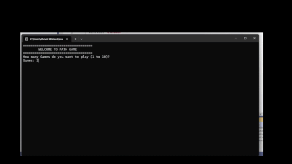

# Math Game (C++ Console Application)

## Demo



---

## A console-based C++ math game that generates random arithmetic questions based on selected difficulty levels and operators. Designed for the Windows terminal with colored feedback for correct and wrong answers, and a summary for each game session. Demonstrates basic C++ concepts such as OOP, random number generation, and input validation.

---

## Features

* Multiple games in one session
* Custom number of questions per game
* Difficulty levels:

  * Easy
  * Medium
  * Hard
  * Mixed
* Arithmetic operations:

  * Addition
  * Subtraction
  * Multiplication
  * Division
  * Random mix of operations
* Colored terminal output for:

  * Correct answers
  * Wrong answers
  * Game results
* Game statistics:

  * Wins
  * Draws
  * Losses

---

## How the Game Works

1. The program starts by asking the player how many games they want to play.
2. For each game the player selects:

   * Number of questions
   * Difficulty level
   * Arithmetic operation type
3. The program generates random math questions.
4. The player answers each question.
5. The program shows whether the answer is correct or incorrect.
6. After each game, a summary is displayed.
7. After all games are finished, a final session summary is shown.

---

## Difficulty Levels

| Level  | Description               |
| ------ | ------------------------- |
| Easy   | Small numbers             |
| Medium | Medium-sized numbers      |
| Hard   | Large numbers             |
| Mix    | Random level per question |

---

## Operations

| Code | Operation          |
| ---- | ------------------ |
| 0    | Addition (+)       |
| 1    | Subtraction (-)    |
| 2    | Multiplication (*) |
| 3    | Division (/)       |
| 4    | Random Operation   |

---

## Requirements

* Windows operating system (uses Windows console API)
* C++ compiler supporting C++11 or later

Examples:

* g++
* Microsoft Visual C++ (MSVC)

---

## Build and Run

### Using g++

```bash
g++ -std=c++17  projectMathGame.cpp -o math_game
m.exe
```

### Using MSVC

```bash
cl projectMathGame.cpp
main.exe
```

---

## Example Gameplay

```
WELCOME TO MATH GAME

How many games do you want to play (1 to 10)?
Games: 2

Game 1

How many questions do you want?
Questions: 5

Question (1 / 5)
7 + 8 =
```

After the game ends, the program displays the results including the number of correct answers and whether the player passed, failed, or drew.

---

## Project Structure

```
projectMathGame.cpp
```

Classes used in the program:

* `Question`

  * Handles question generation
  * Difficulty levels
  * Operations
  * Answer checking

* `Math_Game`

  * Manages game sessions
  * Tracks results
  * Displays summaries

---

## Possible Improvements

Future improvements could include:

* Saving game results to a file
* Adding a timer for each question
* Cross-platform terminal support
* GUI version of the game

---

## Author

Ahmed Waheed
IT Student
